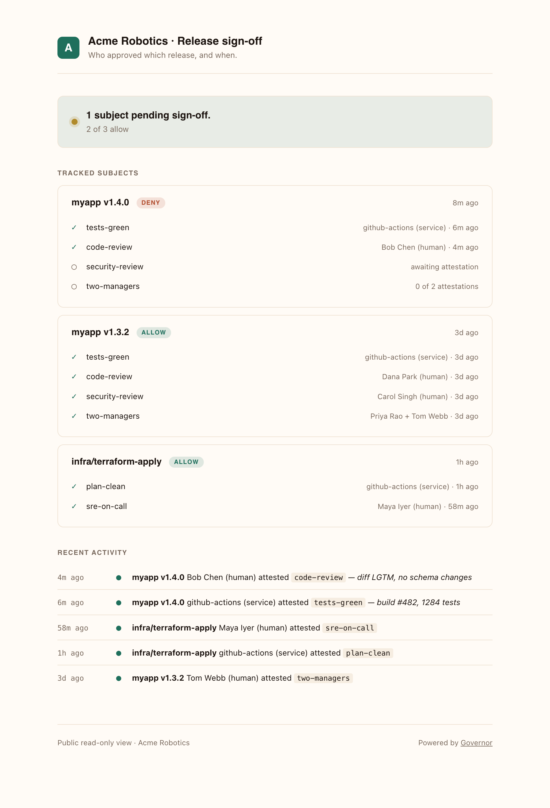

<p align="left">
  
  &nbsp;&nbsp;
  <picture>
    <source media="(prefers-color-scheme: dark)" srcset="./brand/logo-dark.svg">
    
  </picture>
</p>

**An honest record of who signed off on what, before it ships.**

Releases, deployments, model promotions, policy changes — anything that
should require more than one set of eyes — get a shared checklist.
People, CI systems, and AI agents each check the boxes they're
responsible for, in their own name. The result is a page anyone can read.

No one can move the bar after work has started. No one can sign on
someone else's behalf. Nothing gets quietly forgotten in a Slack thread.

<p align="center">
  <picture>
    <source media="(prefers-color-scheme: dark)" srcset="./brand/screenshots/public-dark.png">
    
  </picture>
  <br><sub><i>The public page anyone can link to — what your auditor, your security team, and your CEO actually see.</i></sub>
</p>

## Who it's for

- **Release managers** tired of chasing approvals across Slack, email, and tickets.
- **Security and compliance teams** who need a clean audit trail without owning a heavyweight workflow tool.
- **CI systems and AI agents** that need to attest to things they did, in a way humans can later verify.
- **Auditors and execs** who want to glance at one page and know what's been signed off, by whom, and when.

## How it feels from the command line

Two commands, one round trip each:

```console
$ gov gate myapp@v1.4.0

  ✓  tests-green        ci/github-actions               2m ago
  ✓  code-review        Bob (reviewer)                  4m ago
  ◯  security-review    waiting on  actor_with_role:security-officer
  ◯  two-managers       0 of 2      release-manager · engineering-manager · cto

  ── decision: DENY  ·  2 of 4 satisfied ──────────────────────────────────

$ gov attest myapp@v1.4.0 security-review --note "no new deps; secrets unchanged"

  ✓  recorded as Carol (security-officer)

  ── decision: ALLOW · 4 of 4 satisfied ───────────────────────────────────
```

The gate is a function of attestations and a checklist that was pinned
before work started. Drop `gov gate ... && deploy` into any pipeline and
the deploy can't run until the checklist is satisfied.

> **Pre-release.** Wire formats and APIs may still shift before `v0.1.0`.
> The spec lives in [`spec/`](./spec); breaking changes will be called out
> in release notes.

## Layout

| Path | Role |
|---|---|
| [`spec/`](./spec) | The Governor protocol — wire formats, rule DSL, HTTP API, conformance suite |
| [`core/`](./core) | Pure, embeddable implementations of the rule evaluator |
| [`server/`](./server) | Reference HTTP server implementations |
| [`cli/`](./cli) | Command-line clients |
| [`mcp/`](./mcp) | Model Context Protocol surface for AI agents |
| [`sdks/`](./sdks) | Client libraries |
| [`examples/`](./examples) | Runnable end-to-end walkthroughs against a deployed server |

Each language gets its own subdirectory inside these folders — for example
`core/python/`, `cli/python/`, and later `core/go/`, `cli/go/`.

## Run a server

Six commands, end-to-end: install `gov`, deploy a server, bootstrap, do
something useful. Pick a platform below for a copy-pasteable block.

```sh
# 1. install the CLI (macOS + Linux; Windows: grab a zip from Releases)
curl -fsSL https://raw.githubusercontent.com/makemore/governor/main/install.sh | sh

# 2. deploy a server  ← swap this line for your platform (see fly-outs below)

# 3. bootstrap (uses GOVERNOR_BASE_URL + GOVERNOR_BOOTSTRAP_TOKEN)
gov bootstrap

# 4. confirm
gov whoami

# 5. open a run from a checklist
gov runs new ./release.json

# 6. gate it (exit 0 = allow, exit 1 = deny)
gov gate <run-id>
```

<details>
<summary><b>Cloudflare Workers</b> — D1, no Litestream, replicated by the platform</summary>

[](https://deploy.workers.cloudflare.com/?url=https://github.com/makemore/governor/tree/main/server/worker)

The button forks the repo, provisions the D1 database, wires the binding,
and deploys the worker. When it finishes you have a `*.workers.dev` URL
but no admin yet. Set the bootstrap secret once, then point `gov` at it:

```sh
# in your fork, from server/worker/
TOKEN=$(openssl rand -hex 32)
echo "$TOKEN" | npx wrangler secret put GOVERNOR_BOOTSTRAP_TOKEN

curl -fsSL https://raw.githubusercontent.com/makemore/governor/main/install.sh | sh
GOVERNOR_BASE_URL=https://governor.<you>.workers.dev \
GOVERNOR_BOOTSTRAP_TOKEN=$TOKEN \
  gov bootstrap
gov whoami
# rotate the bootstrap token now: `npx wrangler secret delete GOVERNOR_BOOTSTRAP_TOKEN`
```

Prefer the manual path? Skip the button and run:

```sh
cd server/worker && npm install && npm run db:create
# paste the printed database_id into wrangler.toml, then:
npm run db:migrate:remote
TOKEN=$(openssl rand -hex 32) && echo "$TOKEN" | npx wrangler secret put GOVERNOR_BOOTSTRAP_TOKEN
npm run deploy
```
</details>

<details>
<summary><b>Docker (local, or any host with a daemon)</b> — SQLite + Litestream to your bucket</summary>

```sh
curl -fsSL https://raw.githubusercontent.com/makemore/governor/main/install.sh | sh
cd governor/server/node && cp .env.example .env
# fill in GOVERNOR_BOOTSTRAP_TOKEN and the five LITESTREAM_* values
docker compose up -d
source .env && GOVERNOR_BASE_URL=http://localhost:8080 gov bootstrap
gov whoami
```

Without `LITESTREAM_*` the container refuses to start. That refusal **is**
the durability contract — see [`server/node/README.md`](./server/node/README.md)
for an ephemeral-mode escape hatch (development only).
</details>

<details>
<summary><b>Fly.io</b> — Node image, Litestream sidecar, persistent volume</summary>

```sh
curl -fsSL https://raw.githubusercontent.com/makemore/governor/main/install.sh | sh
cd governor && fly launch --copy-config --no-deploy
TOKEN=$(openssl rand -hex 32)
fly secrets set GOVERNOR_BOOTSTRAP_TOKEN=$TOKEN \
  LITESTREAM_BUCKET=... LITESTREAM_ENDPOINT=... \
  LITESTREAM_ACCESS_KEY_ID=... LITESTREAM_SECRET_ACCESS_KEY=...
fly deploy
GOVERNOR_BASE_URL=https://<app>.fly.dev GOVERNOR_BOOTSTRAP_TOKEN=$TOKEN gov bootstrap
```
</details>

<details>
<summary><b>Render / DigitalOcean / Koyeb</b> — click-to-deploy, then bootstrap</summary>

[](https://render.com/deploy?repo=https://github.com/makemore/governor)
&nbsp;
[](https://cloud.digitalocean.com/apps/new?repo=https://github.com/makemore/governor/tree/main)
&nbsp;
[](https://app.koyeb.com/deploy?type=git&repository=github.com/makemore/governor&branch=main&name=governor&ports=8080;http;/&builder=dockerfile&dockerfile=server/node/Dockerfile&env%5BGOVERNOR_DB_PATH%5D=/tmp/governor.sqlite)

Each platform prompts for the five Litestream secrets before the first
boot — that prompt **is** the durability contract. Once the platform
prints a URL:

```sh
curl -fsSL https://raw.githubusercontent.com/makemore/governor/main/install.sh | sh
GOVERNOR_BASE_URL=https://<your-app-url> \
GOVERNOR_BOOTSTRAP_TOKEN=<token you set during deploy> \
  gov bootstrap
gov whoami
```

Bucket setup takes ~3 minutes:
[Backblaze B2 walkthrough](./server/node/README.md#tier-1-setup-step-by-step-backblaze-b2).
R2, S3, MinIO and Wasabi work identically with a different endpoint.
</details>

<details>
<summary><b>Google Cloud Run</b> — Terraform + Cloud Build, GCS replica, no HMAC keys</summary>

```sh
curl -fsSL https://raw.githubusercontent.com/makemore/governor/main/install.sh | sh
cd governor/deploy/gcp/terraform
cp terraform.tfvars.example terraform.tfvars   # set project_id, region
terraform init && terraform apply
openssl rand -hex 32 \
  | gcloud secrets versions add governor-bootstrap-token --data-file=-
gcloud builds submit ../../.. \
  --config=../cloudbuild.yaml \
  --substitutions=_REGION=europe-west1,_SERVICE=governor,_REPO=governor
GOVERNOR_BASE_URL=$(terraform output -raw service_url) \
GOVERNOR_BOOTSTRAP_TOKEN=<the value you piped above> \
  gov bootstrap
```

Litestream replicates to a GCS bucket using Application Default
Credentials — no HMAC keys to rotate. The Terraform pins the service to
a single instance with always-allocated CPU, because SQLite is
single-writer. Full architecture notes in [`deploy/gcp/README.md`](./deploy/gcp/README.md).
</details>

### Reference servers

| Target | Runtime | Storage | Durability |
|---|---|---|---|
| [Cloudflare Workers](./server/worker) | Workers runtime | D1 (managed, replicated) | ✅ Replicated by the platform |
| [Google Cloud Run](./deploy/gcp) | Node 20 in Docker | SQLite + Litestream → GCS (native ADC auth) | ✅ Replicated to a bucket in your project |
| [Self-host / Render / Fly / DigitalOcean / Koyeb / Railway / VM](./server/node) | Node 20 in Docker | SQLite + Litestream → any S3-compatible bucket | ✅ Replicated to a bucket you own |

**Railway** isn't listed above because it requires publishing a one-time
template through the web UI before the button URL exists. The Dockerfile
and env contract Just Work — connect this repo in the Railway dashboard,
point the service at `server/node/Dockerfile`, and set the secrets.

> **Repo URL note:** the buttons assume this repo is published at
> `https://github.com/makemore/governor`. If the published mirror lives
> at a different slug, swap it once in the three URLs above.

## Design principles

1. **Spec first.** Wire formats are versioned and language-neutral. The
   reference implementation must pass its own conformance suite.
2. **Append-only by default.** Attestations cannot be modified or deleted
   once written. This is enforced at the API, model, and database layers.
3. **No vendor lock-in.** Storage, identity, and notification sinks are
   pluggable. The protocol is portable across implementations.
4. **Human and machine actors are symmetric.** A signed claim is a signed
   claim regardless of who made it. The rule DSL treats them uniformly.

## License

Apache-2.0. See [`LICENSE`](./LICENSE).
